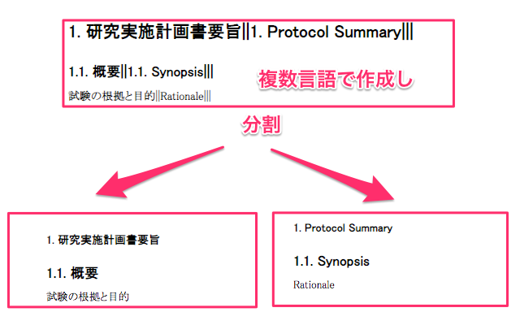

# Google Document Slicer
## 概要


gd-slicerは、多言語文書を効率的に作成するためのGoogleドキュメント用アドオンであり、複数の言語で記載した文章を言語ごとに分割出力する機能を提供します。日本語や英語を含む多言語に対応しており、ドキュメント内の各言語セクションの最後に「|」を追加することで、その言語の終わりを示します。これにより、パラグラフごとに和文と英文を交互に記載したドキュメントを、一括して和文ファイルと英文ファイルという分割版を出力することが可能です。

## 記法
### 2ヶ国語分割

英語、日本語等2ヶ国語の文書を作成する際の記法です。
`|`と`|` で囲われた部分が2ヶ国語目、囲われていない部分が1ヶ国語目として解釈されます


```
日本語|English|

複数行も
対応可能です
|
This notation can interpret
multiple lines.
|
```

上記の文書は

ja

```
日本語

複数行も
対応可能です
```

en

```
English

This notation can interpret
multiple lines.
```

に分割されます.


### 多国語分割

多国語に対応します。
`|` や `||` や `|||` を利用します.
`|` の数を増やすと無限に対応言語を増やすことができます.

- `|` 一つ => 共通セクション
- `||` で終了するセクション => 第1言語
- `|||` で終了するセクション => 第2言語
- `||||` で終了するセクション => 第3言語
- ...


```
Shared context|日本語||English|||한국어|||
複数行も
対応可能です
||
This notation can interpret
multiple lines.
|||

```

上記の文書は


第1言語
```
Shared context 日本語

複数行も
対応可能です
```

第2言語

```
Shared context English

This notation can interpret
multiple lines.
```

第3言語
```
한국어
```

に分割されます.


## 開発

### 準備

``` shell
yarn install --frozen-lockfile
```

### .clasp.json の作成

push 先のGAS を特定するために.clasp.json を生成する必要があります。
またpush フォルダーを dist 配下に固定する必要があります

- `clasp login` Google Apps にログインする
- `clasp create` 新規に作成する
- `clasp clone` 既存のプロジェクトをターゲットにする


### 監視&push

開発中は基本的にこちらを利用します.
TypeScript のソースを Webpack でビルドし、Google Apps Script 用に変換して Google Drive にプッシュします

```shell
yarn push
```

### テスト

``` shell
yarn test
```


License
-------
gd-slicer is licensed under the [MIT](#) license.  
Copyright &copy; 2025, NHO Nagoya Medical Center and NPO-OSCR
